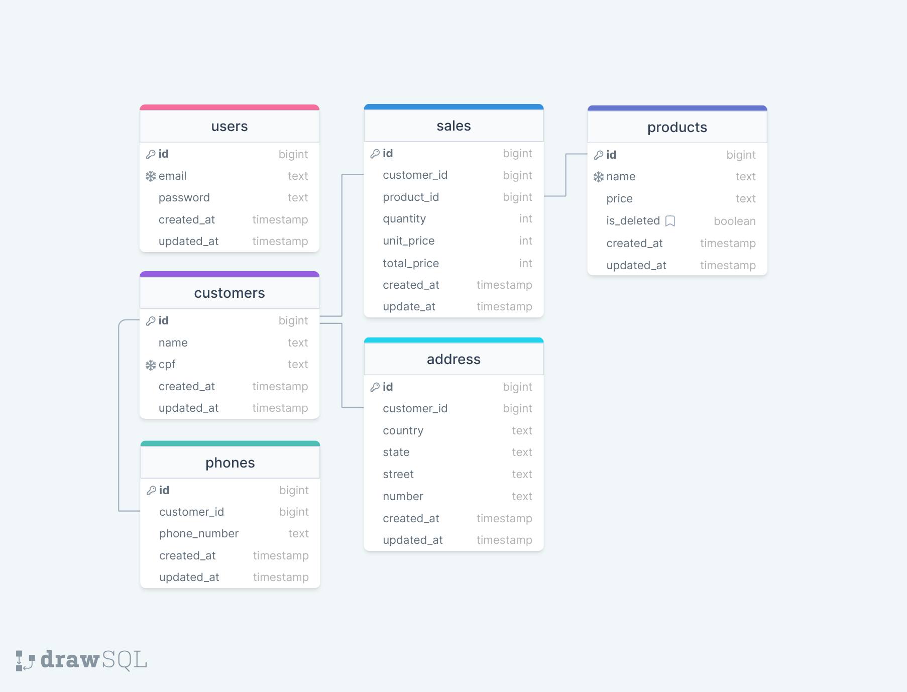

# Backend API AdonisJS

Trata-se de um sistema que permite cadastrar usuários externos. Ao realizarem login, estes usuários deverão poder registrar clientes, produtos e vendas.

## Getting Started

Para começar com este projeto, siga estas etapas:

1. Clone este repositório em sua máquina local.
2. Certifique-se de ter o `Node.js LTS 20.11.1` instalado em sua máquina.
3. Instale dependências executando `npm install` no diretório do projeto.
4. Defina a configuração do seu banco de dados no arquivo `.env`. Para isso crie o banco de dados `mysql` pelo seu terminal `CREATE DATABASE db;` e faça a compatibilidade com as migrations do adonisjs `ALTER USER 'user'@'%' IDENTIFIED WITH mysql_native_password BY '123456';`
5. Execute as migrações do banco de dados executando `node ace migration:run`.
6. Inicie o servidor executando `npm run dev`.

## Draw SQL
<div>
  
</div>


## Endpoints

### Users

#### Sign Up
- **Rota:** `POST /users/signup`
- **Descrição:** Cria um novo usuário.
- **Body:**
  ```json
  {
    "email":"email@email.com",
    "password":"1234"
  }
  ```
#### Login
- **Rota:** `POST /users/login`
- **Descrição:** Autentica um usuário.
- **Body:**
  ```json
  {
    "email":"email@email.com",
    "password":"1234"
  }
  ```
- **Resposta:** JWT token.

### Customers

#### List Customers
- **Rota:** `GET /customers`
- **Descrição:** Recupera uma lista de todos os clientes.
- **Headers:**
```json
  {
    "Authorization":"Bearer eyJhbGciOiJI..."
  }
  ```
- **Resposta:** Um array de objetos de clientes.

#### Get Customer by ID
- **Rota:** `GET /customers/:id`
- **Descrição:** Recupera um cliente e vendas dele específico por ID. Não dá opções de ordenar ou filtrar.
- **Headers:**
```json
  {
    "Authorization":"Bearer eyJhbGciOiJI..."
  }
  ```
- **Resposta:** Objeto de cliente e suas vendas.

#### Create Customer
- **Rota:** `POST /customers`
- **Descrição:** Cria um novo cliente.
- **Headers:**
```json
  {
    "Authorization":"Bearer eyJhbGciOiJI..."
  }
  ```
- **Body:**
```json
  {
    "name":"John Doe",
    "cpf":"12345678901",
    "phone_number":"1234567890",
    "country":"Brazil",
    "state":"São Paulo",
    "street":"Rua A",
    "number":"123"
  }
  ```

#### Update Customer
- **Rota:** `PUT /customers/:id`
- **Descrição:** Atualiza um cliente existente.
- **Headers:**
```json
  {
    "Authorization":"Bearer eyJhbGciOiJI..."
  }
```
- **Body:**
```json
  {
    "name":"John Doe",
    "cpf":"12345678901"
  }
```

#### Delete Customer
- **Rota:** `DELETE /customers/:id`
- **Descrição:** Deleta um cliente por ID.
- **Headers:**
```json
  {
    "Authorization":"Bearer eyJhbGciOiJI..."
  }
```

### Products

#### List Products
- **Rota:** `GET /products`
- **Descrição:** Recupera uma lista de todos os produtos.
- **Headers:**
```json
  {
    "Authorization":"Bearer eyJhbGciOiJI..."
  }
```
- **Resposta:** Um array de objetos de produtos.

#### Get Product by ID
- **Rota:** `GET /products/:id`
- **Descrição:** Recupera um produto específico por ID.
- **Headers:**
```json
  {
    "Authorization":"Bearer eyJhbGciOiJI..."
  }
```
- **Resposta:** Objeto de produto.

#### Create Product
- **Rota:** `POST /products`
- **Descrição:** Cria um novo produto.
- **Headers:**
```json
  {
    "Authorization":"Bearer eyJhbGciOiJI..."
  }
```
- **Body:**
```json
  {
    "name":"Product",
    "price": 100
  }
```

#### Update Product
- **Rota:** `PUT /products/:id`
- **Descrição:** Atualiza um produto existente.
- **Headers:**
```json
  {
    "Authorization":"Bearer eyJhbGciOiJI..."
  }
```
- **Body**:
```json
  {
    "name":"Product",
    "price": 100
  }
```

#### Soft Delete Product
- **Rota:** `DELETE /products/:id`
- **Descrição:** Deleta um produto por ID.
- **Headers:**
```json
  {
    "Authorization":"Bearer eyJhbGciOiJI..."
  }
```

### Sales

#### Create Sale
- **Rota:** `POST /sales`
- **Descrição:** Creates a new sale.
- **Headers:**
```json
  {
    "Authorization":"Bearer eyJhbGciOiJI..."
  }
```
- **Body**:
```json
  {
    "customer_id": 1,
    "product_id": 1,
    "quantity": 1
  }
```

